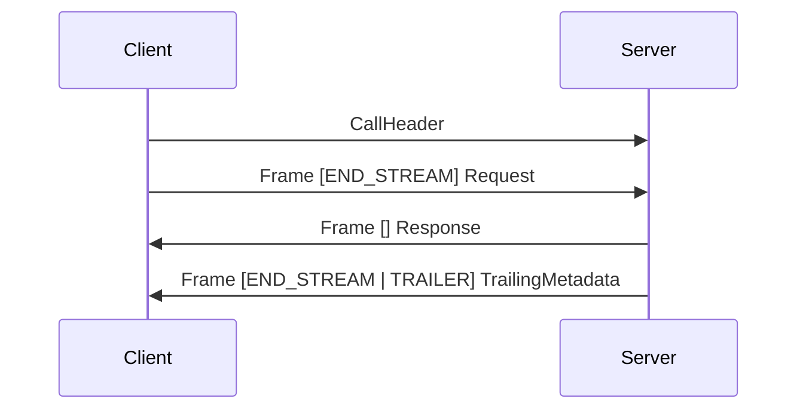
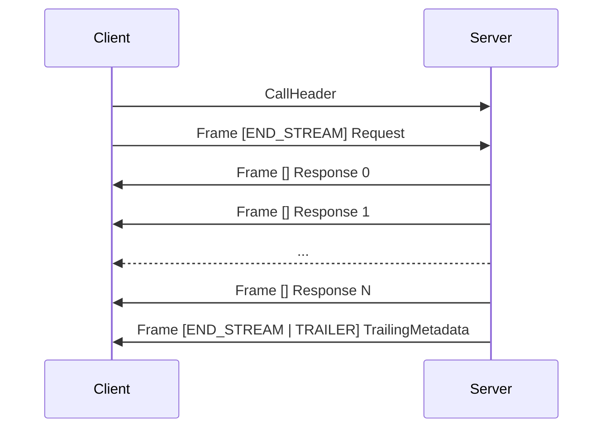
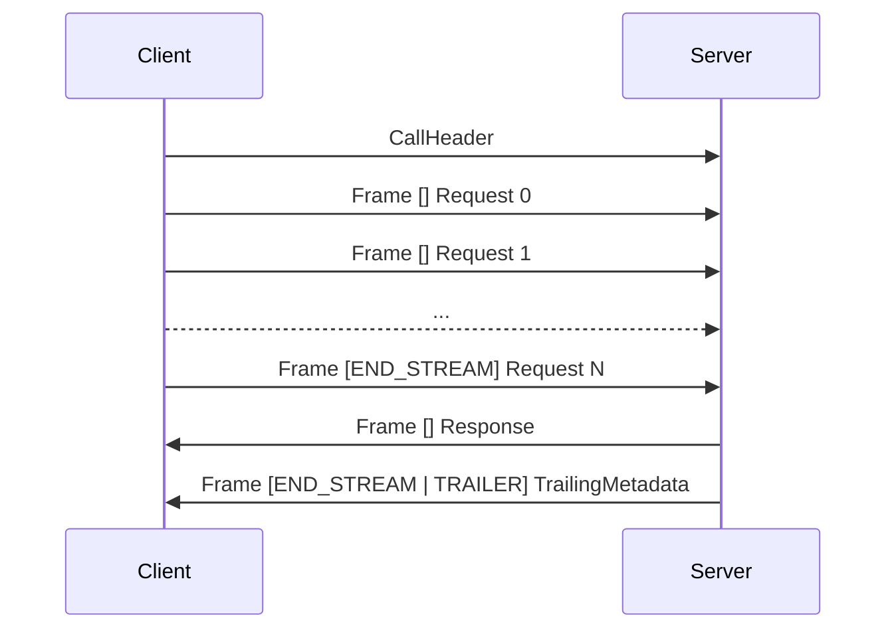
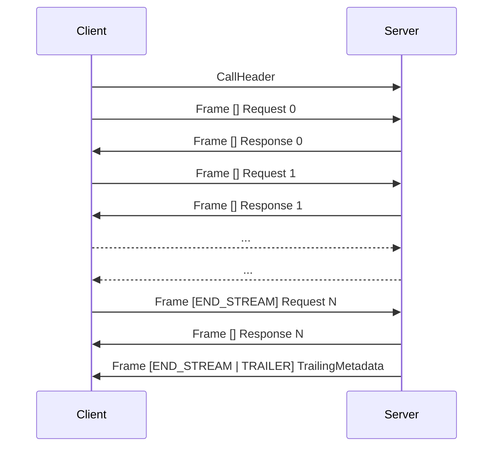

# Bebop RPC

Wire protocol for Bebop service methods. Transport-agnostic framing and call semantics for unary and streaming RPCs.

Every byte on the wire is Bebop-encoded. The protocol types are defined in `bebop/rpc.bop`. Implementations decode RPC frames with the same generated code they use for application types.

The key words "MUST", "MUST NOT", "SHOULD", "SHOULD NOT", and "MAY" in this document are to be interpreted as described in RFC 2119.

## 1. Schema

```bebop
edition = "2026"
package bebop

import "bebop/decorators.bop"
import "bebop/empty.bop"

enum StatusCode : byte {
    OK = 0;
    CANCELLED = 1;
    UNKNOWN = 2;
    INVALID_ARGUMENT = 3;
    DEADLINE_EXCEEDED = 4;
    NOT_FOUND = 5;
    PERMISSION_DENIED = 7;
    RESOURCE_EXHAUSTED = 8;
    UNIMPLEMENTED = 12;
    INTERNAL = 13;
    UNAVAILABLE = 14;
    UNAUTHENTICATED = 16;
}

@flags
enum FrameFlags : byte {
    NONE = 0;
    END_STREAM = 1;
    ERROR = 2;
    COMPRESSED = 4;
    TRAILER = 8;
}

enum MethodType : byte {
    UNARY = 0;
    SERVER_STREAM = 1;
    CLIENT_STREAM = 2;
    DUPLEX_STREAM = 3;
}

struct FrameHeader {
    length: uint32;
    flags: FrameFlags;
    stream_id: uint32;
}

message CallHeader {
    method_id(1): uint32;       // MurmurHash3 of /ServiceName/MethodName
    deadline(2): timestamp;     // absolute, omit for no deadline
    metadata(3): map[string, string];
}

message RpcError {
    code(1): StatusCode;
    detail(2): string;
    metadata(3): map[string, string];
}

message TrailingMetadata {
    metadata(1): map[string, string];
}

struct MethodInfo {
    name: string;
    method_id: uint32;
    method_type: MethodType;
    request_type_url: string;   // e.g. "type.bebop.sh/myapp.HelloRequest"
    response_type_url: string;  // e.g. "type.bebop.sh/myapp.HelloResponse"
}

struct ServiceInfo {
    name: string;
    methods: MethodInfo[];
}

struct DiscoveryResponse {
    services: ServiceInfo[];
}

struct BatchCall {
    call_id: int32;      // client-assigned, unique within batch, zero-indexed
    method_id: uint32;   // MurmurHash3 of /ServiceName/MethodName
    payload: byte[];     // wire-encoded request, ignored when input_from >= 0
    input_from: int32;   // pipe result of this call_id as input, -1 = use payload
}

struct BatchRequest {
    calls: BatchCall[];
    metadata: map[string, string];  // applied to every call in the batch
}

struct BatchSuccess {
    payloads: byte[][];
}

union BatchOutcome {
    Success(1): BatchSuccess;
    Error(2): RpcError;
}

struct BatchResult {
    call_id: int32;
    outcome: BatchOutcome;
}

struct BatchResponse {
    results: BatchResult[];
}
```

## 2. Terminology

| Term | Meaning |
|------|---------|
| **call** | One RPC invocation: request and response exchange for a single method. |
| **frame** | A `FrameHeader` followed by a Bebop-encoded payload. The atomic unit on the wire. |
| **stream** | Ordered sequence of frames in one direction within a call. |
| **method ID** | 32-bit routing key. MurmurHash3 of `/ServiceName/MethodName`, computed at schema compile time. |
| **call header** | `CallHeader` message sent once at the start of a binary call. Carries method ID, optional deadline, metadata. |
| **deadline** | Absolute point in time after which the caller abandons the call. |
| **metadata** | String key-value pairs propagated alongside a call. |

## 3. Method types

Four calling conventions, matching the `stream` keyword in service definitions:

| Type | Schema syntax | Request | Response |
|------|--------------|---------|----------|
| Unary | `Method(Req): Resp` | 1 message | 1 message |
| Server streaming | `Method(Req): stream Resp` | 1 message | N messages |
| Client streaming | `Method(stream Req): Resp` | N messages | 1 message |
| Duplex streaming | `Method(stream Req): stream Resp` | N messages | N messages |

## 4. Status codes

Every completed call has a status. Code 0 is success. All others are errors.

| Code | Name | When to use |
|------|------|-------------|
| 0 | OK | Call succeeded. |
| 1 | CANCELLED | Caller cancelled before completion. |
| 2 | UNKNOWN | Error that doesn't fit another code. |
| 3 | INVALID_ARGUMENT | Malformed or invalid request. Not retryable without fixing the input. |
| 4 | DEADLINE_EXCEEDED | Deadline passed before the server produced a response. |
| 5 | NOT_FOUND | Method or service does not exist. |
| 7 | PERMISSION_DENIED | Caller is authenticated but not authorized. |
| 8 | RESOURCE_EXHAUSTED | Rate limit, quota, or backpressure. Retryable after backing off. |
| 12 | UNIMPLEMENTED | Method exists in the schema but the server has no handler. |
| 13 | INTERNAL | Server-side bug. |
| 14 | UNAVAILABLE | Transient. Service is down or overloaded. Retry with backoff. |
| 16 | UNAUTHENTICATED | Missing or invalid credentials. |

Codes 6, 9-11, 15 are reserved. Codes 17-255 are available for application-specific errors. Codes 0-16 align with gRPC numbering so bridging implementations can pass codes through without remapping.

## 5. Frames

Each frame is a `FrameHeader` struct followed by a payload.

```
+------------------+---------------+-------------------+-----------------+
| length (uint32)  | flags (byte)  | stream_id (uint32)| payload         |
|                  |               |                   | (length bytes)  |
+------------------+---------------+-------------------+-----------------+
```

| Field | Offset | Size | Encoding |
|-------|--------|------|----------|
| length | 0 | 4 | Payload byte count, uint32 little-endian. |
| flags | 4 | 1 | `FrameFlags` bitfield. |
| stream_id | 5 | 4 | uint32 little-endian. |

`FrameHeader` is a Bebop struct: 9 bytes, no tags, no length prefix, fields in declaration order. Parsing a frame header means reading exactly 9 bytes.

Wire cost per frame: 9 + payload bytes. For a unary call over a binary transport, the overhead is 18 bytes total (one frame each direction).

### 5.1. Flags

| Value | Name | Meaning |
|-------|------|---------|
| 0x01 | END_STREAM | Last frame in this direction. No more frames will follow from this sender. |
| 0x02 | ERROR | Payload is an `RpcError`. MUST combine with END_STREAM. |
| 0x04 | COMPRESSED | Payload is compressed. Algorithm negotiated via metadata. |
| 0x08 | TRAILER | Payload is a `TrailingMetadata`. MUST combine with END_STREAM. |

Remaining bits are reserved. Senders MUST set them to 0. Receivers MUST ignore them.

Invalid combinations:

- ERROR without END_STREAM
- TRAILER without END_STREAM
- ERROR and TRAILER both set (error metadata goes inside `RpcError.metadata`)

Receivers SHOULD treat these as protocol errors and close the connection.

Flags combine with bitwise OR. A frame ending a stream with an error: `END_STREAM | ERROR` = `0x03`. A frame with trailing metadata: `END_STREAM | TRAILER` = `0x09`.

### 5.2. Stream identifiers

Stream IDs multiplex concurrent calls over a single connection.

- `0` means no multiplexing. The transport already provides call isolation (HTTP/2 streams, separate WebSocket connections, per-call IPC channels). Most transports SHOULD use 0.
- Non-zero values identify a call within a multiplexed connection. Each call gets a unique stream ID for its lifetime. Assignment rules depend on the transport binding.

### 5.3. Error frames

When ERROR is set, the payload is a Bebop-encoded `RpcError` message. The `metadata` field carries any response metadata the handler set before the error. Omit it when there is none.

Example — `NOT_FOUND` with detail `"GreeterService.Helloo"`:

```
frame header (9 bytes):
1f 00 00 00       // length = 31
03                // flags = END_STREAM | ERROR
00 00 00 00       // stream_id = 0

payload (31 bytes, RpcError message encoding):
1e 00 00 00       // message length = 30 bytes
01                // tag 1 (code)
05                // StatusCode.NOT_FOUND = 5
02                // tag 2 (detail)
15 00 00 00       // string length = 21
47 72 65 65 74 65 72 53 65 72 76 69 63 65 2e 48 65 6c 6c 6f 6f  // "GreeterService.Helloo"
00                // NUL terminator
00                // end marker
```

## 6. Call header

The `CallHeader` message initiates a call on binary transports. The client sends it as the first bytes on the connection (or the first binary message on WebSocket). On HTTP, call header fields map to HTTP mechanisms (URL path, headers) and no `CallHeader` is sent.

| Field | Description |
|-------|-------------|
| `method_id` | MurmurHash3 of `/ServiceName/MethodName`. Routes to the handler. |
| `deadline` | Absolute timestamp. Omit for no deadline. Bebop `timestamp` type (seconds + nanoseconds since Unix epoch). |
| `metadata` | Key-value pairs. Keys and values are UTF-8 strings. |

The call header is a Bebop message with a uint32 length prefix. After the call header, everything is frames.

## 7. Call lifecycle

### 7.1. Unary



Given:

```bebop
struct HelloRequest  { name: string; }
struct HelloResponse { greeting: string; }
```

A call to method ID `0x1a2b3c4d` with `HelloRequest { name: "Alice" }` returning `HelloResponse { greeting: "Hello, Alice!" }`:

```
client -> CallHeader (message encoding):
  06 00 00 00                            // message length = 6
  01                                     // tag 1 (method_id)
  4d 3c 2b 1a                           // uint32 0x1a2b3c4d
  00                                     // end marker

client -> request frame:
  0a 00 00 00                            // length = 10
  01                                     // flags = END_STREAM
  00 00 00 00                            // stream_id = 0
  05 00 00 00                            // string length = 5
  41 6c 69 63 65 00                      // "Alice" + NUL

server -> response frame:
  12 00 00 00                            // length = 18
  01                                     // flags = END_STREAM
  00 00 00 00                            // stream_id = 0
  0d 00 00 00                            // string length = 13
  48 65 6c 6c 6f 2c 20 41 6c 69 63 65   // "Hello, Alice!"
  21 00                                  // "!" + NUL

total: 10 + 19 + 27 = 56 bytes
```

The trailer frame is optional. If the server has no response metadata, the response frame carries END_STREAM directly (as shown above). On error, the server sends one frame with `END_STREAM | ERROR` containing an `RpcError` payload.

On HTTP, the call header is implicit (URL path + headers) and request/response bodies are bare Bebop payloads without framing. See section 16.

### 7.2. Server streaming



Client sends the call header and one request frame with END_STREAM. Server sends zero or more response frames, then ends with a trailer frame or sets END_STREAM on the last response frame.

### 7.3. Client streaming



Client sends the call header and zero or more request frames, with END_STREAM on the last. Server waits for the client to finish, then sends one response frame and an optional trailer.

The server MAY send its response before the client finishes. This signals early termination: the client SHOULD stop sending and the server SHOULD discard further request frames.

### 7.4. Duplex streaming



Both sides send frames independently. Request and response frames are not correlated. Either side signals completion with END_STREAM.

## 8. Cancellation

### 8.1. Client behavior

To cancel an in-flight call, the client closes its send direction for that call:

| Transport | How to cancel |
|-----------|---------------|
| Binary (TCP, IPC) | Close the connection, or send END_STREAM on the request stream without waiting for the response. |
| WebSocket | Send a close frame, or close the connection. |
| HTTP/1.1 | Abort the request (close the TCP connection). |
| HTTP/2 | Send RST_STREAM on the HTTP/2 stream. |
| Multiplexed binary | Send END_STREAM on the call's stream ID. Other calls on the same connection are unaffected. |

Clients SHOULD NOT expect a response after cancelling.

### 8.2. Server behavior

Servers MUST detect cancellation and propagate it to handlers. The mechanism depends on the transport:

- **Connection closed**: the server's read or write fails. Treat as cancellation.
- **HTTP/2 RST_STREAM**: the server receives a stream reset. Treat as cancellation.
- **END_STREAM received early**: during client streaming or duplex streaming, the client may send END_STREAM before the server expects it. This is normal completion, not cancellation. Cancellation means the client does not want the response. END_STREAM means the client is done sending but still wants the response.

When the server detects cancellation:

1. Set the cancellation flag on the call context (`isCancelled` returns true).
2. Stop reading from the request stream.
3. Stop writing to the response stream.
4. Clean up resources.
5. Do not send an error frame. The client already disconnected.

Handlers SHOULD check `isCancelled` periodically during long operations.

### 8.3. Cancellation and deadlines

When a deadline passes, the server SHOULD treat it like cancellation, with one difference: if the server can still send, it SHOULD send DEADLINE_EXCEEDED before closing. The client may still be connected and waiting.

Both cancellation and deadline expiry are surfaced through `CallContext.isCancelled`. Handlers do not need to distinguish between them.

## 9. Metadata

String key-value pairs carried alongside a call.

Key rules: ASCII lowercase letters, digits, hyphens, underscores. Keys starting with `bebop-` are reserved for protocol use.

### 9.1. Request metadata

Sent once at the start of a call. On binary transports, carried in `CallHeader.metadata`. On HTTP, mapped to request headers.

### 9.2. Response metadata (trailing)

Sent once after all response data. On binary transports, the server sends a TRAILER frame (`END_STREAM | TRAILER`) with a `TrailingMetadata` payload after the last data frame.

On HTTP, trailing metadata maps to HTTP trailers (HTTP/2) or response headers for unary calls.

On error, response metadata goes in `RpcError.metadata`. No separate trailer frame.

### 9.3. Reserved keys

| Key | Description |
|-----|-------------|
| `bebop-encoding` | Payload compression: `identity` (default), `gzip`, `zstd`, `lz4`. |
| `bebop-accept-encoding` | Accepted compression algorithms, comma-separated. |

## 10. Deadlines

Deadlines are absolute timestamps, not relative durations. A 5-second timeout becomes `now + 5s` as an absolute time. Every downstream hop checks the same deadline without accumulating jitter.

On binary transports, the deadline is `CallHeader.deadline` (Bebop `timestamp`, 12 bytes, nanosecond precision). On HTTP, the deadline is the `bebop-deadline` header with a decimal millisecond Unix timestamp.

If the deadline has passed when the server receives the call, it MUST return DEADLINE_EXCEEDED without invoking the handler.

Servers MUST propagate deadlines to downstream calls. When making a downstream call, use the earlier of the propagated deadline and any locally configured timeout. Never extend a caller's deadline.

## 11. Authentication

Not defined by this protocol. Credentials travel as metadata.

A client attaches credentials by setting a metadata key (e.g., `authorization`). The server reads the key and returns UNAUTHENTICATED (16) if the credential is missing or invalid, or PERMISSION_DENIED (7) if the credential is valid but insufficient.

## 12. Batching

Method ID 1 is reserved for batch calls. A batch combines multiple unary and server-stream calls into a single round trip. The client sends a `BatchRequest`, the server executes all calls, and returns a `BatchResponse` with per-call results.

On binary transports, this is a unary call to method ID 1. On HTTP: `POST /_bebop/batch` with content type `application/bebop`.

Each `BatchCall` targets a method by its method ID and either supplies its own payload or references a previous call's result via `input_from`. When `input_from` is >= 0, the server uses the first payload from the referenced call's `BatchSuccess` as the request bytes. The `payload` field is ignored. When `input_from` is -1, the call uses its own payload.

`BatchResponse` contains one `BatchResult` per call, in the same order as the request. For unary methods, `BatchSuccess.payloads` contains one element. For server-stream methods, it contains all buffered responses in order.

### 12.1. Execution model

The server MUST:

1. **Validate** all calls before executing any. Reject the entire batch with INVALID_ARGUMENT if any `call_id` is negative, if there are duplicate `call_id` values, or if `input_from` references a `call_id` that doesn't appear earlier in the list.

2. **Build a dependency graph** from `input_from` references. Calls with `input_from = -1` have no dependencies and form the first execution layer.

3. **Execute each layer in parallel**. All calls within a layer MUST run concurrently. Calls in later layers wait for their dependencies to complete.

4. **Propagate failures**. If a call fails, all calls that depend on it via `input_from` also fail with INVALID_ARGUMENT and the detail `"dependency {call_id} failed"`.

5. **Respect the deadline**. If the batch's deadline expires mid-execution, remaining calls SHOULD fail with DEADLINE_EXCEEDED. Completed calls keep their results.

Client-stream and duplex methods are not supported in batches. If a `BatchCall` targets one, its result is an error with code INVALID_ARGUMENT.

### 12.2. Example

```
Batch request:
  call_id=0  method=GetUser       payload=<encoded GetUserRequest>
  call_id=1  method=ListFriends   input_from=0
  call_id=2  method=GetSettings   payload=<encoded GetSettingsRequest>

Execution:
  Layer 0: GetUser (call 0) and GetSettings (call 2) run in parallel
  Layer 1: ListFriends (call 1) runs after call 0, using its response as input

Batch response:
  call_id=0  Success { payloads: [<GetUserResponse bytes>] }
  call_id=1  Success { payloads: [<ListFriendsResponse bytes>] }
  call_id=2  Success { payloads: [<GetSettingsResponse bytes>] }
```

## 13. Service discovery

Method ID 0 is reserved for service discovery. Request type is `bebop.Empty` (zero bytes). Response type is `DiscoveryResponse`.

Servers that support discovery handle method ID 0 like any unary call. Servers that do not MUST return UNIMPLEMENTED.

Discovery is optional. Most clients use generated code and know the schema at compile time. Discovery exists for tooling: CLI debuggers, service meshes, API gateways.

## 14. Server requirements

### 14.1. Connection handling

The server MUST handle multiple concurrent connections. Each connection handles at least one call. On multiplexed transports, a single connection handles multiple concurrent calls identified by stream ID.

The server MUST NOT block one call waiting for another to complete, unless they are in the same batch with an `input_from` dependency.

### 14.2. Call dispatch

When a call arrives:

1. Parse the `CallHeader` (binary) or extract routing from HTTP path and headers.
2. Check the deadline. If already passed, return DEADLINE_EXCEEDED without invoking the handler.
3. Look up the method ID. If not found, return NOT_FOUND.
4. Verify the method type matches the calling convention. A unary method invoked as server-stream SHOULD return UNIMPLEMENTED.
5. Run interceptors, if any.
6. Invoke the handler.

### 14.3. Deadline enforcement

The server MUST track deadlines for every call that has one. When a deadline expires:

1. Set the cancellation flag on the call context.
2. Cancel the handler's task/coroutine if it hasn't returned.
3. Send DEADLINE_EXCEEDED if the response stream is still writable.
4. Clean up resources.

### 14.4. Error handling

If the handler throws an error:

- If the error is a `BebopRpcError` (or the language-specific equivalent), use its status code and detail.
- Otherwise, wrap it as INTERNAL with the error description as the detail. Do not leak stack traces to the client in production.

If the handler panics, return INTERNAL. One bad call MUST NOT crash the process.

### 14.5. Streaming

For server-stream calls, the server MUST:

- Send response frames as the handler produces them. Do not buffer all responses.
- Send END_STREAM after the handler finishes.
- If the handler fails mid-stream, send an ERROR frame.

For client-stream and duplex calls, the server MUST:

- Deliver request frames to the handler as they arrive.
- Apply backpressure if the handler falls behind. Do not buffer unbounded request data in memory.
- Handle END_STREAM as normal completion of the request stream, not cancellation.

### 14.6. Concurrency

Handlers MUST run concurrently. A slow handler MUST NOT block dispatch of other calls.

For batch calls, the server MUST execute independent calls (same dependency layer) concurrently. Sequential execution of independent batch calls is a conformance violation.

### 14.7. Resource limits

Implementations SHOULD enforce:

- Maximum concurrent calls per connection
- Maximum concurrent streams for multiplexed transports
- Maximum batch size
- Maximum frame payload size
- Maximum request metadata size

When a limit is exceeded, return RESOURCE_EXHAUSTED.

## 15. Client requirements

### 15.1. Call lifecycle

The client MUST:

1. Encode the `CallHeader` and send it as the first message (binary) or set HTTP path and headers.
2. Encode the request and send it in one or more frames.
3. Set END_STREAM on the last request frame.
4. Read response frames until the server sends END_STREAM.
5. If the response frame has ERROR, decode the `RpcError` payload and surface it to the caller.
6. If the response frame has TRAILER, decode `TrailingMetadata` and make it available to the caller.

### 15.2. Deadline propagation

If the caller sets a deadline, the client MUST include it in the `CallHeader`. The client SHOULD also enforce the deadline locally: if it passes while waiting for a response, cancel the call and surface DEADLINE_EXCEEDED without waiting for the server.

### 15.3. Cancellation

The client MUST provide a way to cancel in-flight calls. Cancellation MUST immediately close or reset the transport-level connection for that call. The client MUST NOT wait for a server response after cancelling.

### 15.4. Error decoding

The client MUST handle ERROR frames at any point during a streaming call, including after receiving partial results. Both partial results and the error MUST be surfaced to the caller.

## 16. Transport: HTTP

Maps Bebop RPC onto HTTP/1.1 and HTTP/2.

### 16.1. Routing

```
POST /{ServiceName}/{MethodName}
```

Path components use service and method names as they appear in the schema. Example: `POST /GreeterService/SayHello`.

### 16.2. Content type

| Mode | Content-Type |
|------|-------------|
| Unary | `application/bebop` |
| Streaming | `application/bebop+stream` |

### 16.3. Metadata mapping

Metadata keys map to HTTP headers. Reserved keys already have the `bebop-` prefix.

```
bebop-deadline: 1739412345678
bebop-encoding: zstd
authorization: Bearer tok_abc123
x-request-id: abc-123
```

`bebop-deadline` is a decimal millisecond Unix timestamp.

### 16.4. Unary calls

Request body: bare Bebop-encoded request. Response body: bare Bebop-encoded response. No framing.

Success:

```
HTTP/1.1 200 OK
Content-Type: application/bebop
x-pagination-cursor: abc123

<response bytes>
```

Response metadata goes in HTTP response headers for unary calls.

Error:

```
HTTP/1.1 <mapped status>
Content-Type: application/bebop
bebop-status: <code>

<RpcError bytes>
```

`bebop-status` carries the status code for infrastructure that inspects headers without decoding the body.

Status code mapping:

| Bebop status | HTTP status |
|-------------|-------------|
| CANCELLED | 499 |
| INVALID_ARGUMENT | 400 |
| DEADLINE_EXCEEDED | 408 |
| NOT_FOUND | 404 |
| PERMISSION_DENIED | 403 |
| RESOURCE_EXHAUSTED | 429 |
| UNIMPLEMENTED | 501 |
| INTERNAL | 500 |
| UNAVAILABLE | 503 |
| UNAUTHENTICATED | 401 |
| UNKNOWN | 500 |

### 16.5. Streaming calls

HTTP response status is always `200`. The body is a sequence of frames. Errors are conveyed in ERROR frames, not via HTTP status.

Request body for server streaming: bare Bebop payload (one message). Request body for client streaming and duplex: a sequence of frames.

Trailing metadata on HTTP/2 maps to HTTP trailers. On HTTP/1.1, trailing metadata is sent as a TRAILER frame in the response body.

HTTP/1.1: use chunked transfer encoding. Each chunk SHOULD contain one or more complete frames.

HTTP/2: frames map to DATA frames. Bebop stream IDs SHOULD be 0.

Duplex streaming requires HTTP/2. Server streaming and client streaming work over HTTP/1.1.

### 16.6. Batch endpoint

```
POST /_bebop/batch
Content-Type: application/bebop

<BatchRequest bytes>
```

Response is a `BatchResponse`. Errors in individual batched calls are in the `BatchResult`, not in the HTTP status.

## 17. Transport: binary

For raw byte streams: WebSocket, TCP, Unix domain sockets, IPC channels, shared memory.

### 17.1. Call initiation

Client sends a Bebop-encoded `CallHeader` as the first bytes on the connection (or first binary message on WebSocket). The receiver reads 4 bytes for the length, then that many bytes, and decodes the `CallHeader`.

After the call header, all data is frames.

### 17.2. Unary calls

```
Client -> CallHeader
Client -> Frame { payload: <request>,  flags: END_STREAM }
Server -> Frame { payload: <response>, flags: END_STREAM }
```

With trailing metadata:

```
Client -> CallHeader
Client -> Frame { payload: <request>,  flags: END_STREAM }
Server -> Frame { payload: <response>, flags: NONE }
Server -> Frame { payload: <TrailingMetadata>, flags: END_STREAM | TRAILER }
```

### 17.3. Streaming calls

Same frame protocol as section 7. Every message in both directions is a frame with a 9-byte header.

### 17.4. WebSocket

Each WebSocket binary message carries exactly one protocol element:

1. First binary message: `CallHeader` bytes
2. Subsequent binary messages: one frame each (header + payload)

Stream IDs SHOULD be 0. Each WebSocket connection handles one call. Multiplex by opening multiple connections.

### 17.5. TCP and Unix sockets

Byte stream layout: `CallHeader`, then frames concatenated end-to-end. The receiver reads each frame by parsing the 9-byte header, then reading `length` bytes of payload.

For multiplexing over a single connection, use non-zero stream IDs. Client-initiated streams use odd IDs; server-initiated streams use even IDs.

### 17.6. IPC and shared memory

Same byte layout as TCP. Each transport-level message SHOULD contain one complete `CallHeader` or one complete frame.

## 18. Call context

Handlers receive a `CallContext` for every call. Every `CallContext` provides:

- **Request metadata** — from `CallHeader.metadata` or HTTP headers. Read-only.
- **Response metadata** — mutable. Sent as trailing metadata after the handler returns.
- **Deadline** — when the call expires. Nil if no deadline was set.
- **Cancellation** — true when the client disconnected or the deadline expired.

`CallContext` is an interface. Transport implementations provide concrete types. The handler signature references only the interface.

### 18.1. Transport-specific access

Handlers that need transport-specific features downcast the context:

```
func sayHello(ctx: CallContext, request: HelloRequest) -> HelloResponse {
    if let httpCtx = ctx as? HttpCallContext {
        httpCtx.setResponseHeader("Cache-Control", "max-age=60")
    }
    // ...
}
```

Handlers that stick to the interface work on every transport. Handlers that downcast only work on the transport they target.

### 18.2. Interceptors

Interceptors wrap handler dispatch. They receive the method ID and call context, and decide whether to proceed or reject the call.

Interceptors run in registration order. The first registered interceptor is the outermost. Interceptors can short-circuit by throwing an error instead of calling `proceed`.

## 19. Design rationale

### Everything is Bebop-encoded

The call header, frame header, error payload, batch protocol, and discovery response are all Bebop types. An implementation that can decode Bebop messages can decode every part of the RPC protocol.

### Fixed 9-byte frame header

`FrameHeader` is a Bebop struct. No tags, no length prefix, fields in declaration order. Parse it by reading 9 bytes. Success and failure use the same format.

Binary transports use frames even for unary calls. The cost is 18 bytes per call (9 each direction). The benefit: the ERROR flag handles error signaling uniformly. Without framing, a binary transport would need a separate mechanism to distinguish a response from an error.

HTTP unary calls skip framing because HTTP already provides request/response boundaries and status codes.

### Trailing metadata

Response metadata is trailing because the server doesn't have it at the start. Cache hit/miss, row counts, pagination tokens all emerge during or after processing.

Bebop RPC solves this at the frame level: a TRAILER frame after the last data frame. This works on every transport. On error, metadata goes inside `RpcError.metadata`.

### Absolute deadlines

Relative timeouts accumulate error across hops. If service A gives service B a 5-second timeout, and B spends 3 seconds then gives service C a new 5-second timeout, C thinks it has 5 seconds when A expects everything done in 2. Absolute deadlines avoid this. Every hop checks the same wall-clock time.

### No built-in auth

Credentials reduce to "attach a value, check it on the server." Metadata handles attachment. Status codes handle the error cases.

### Method IDs instead of strings

MurmurHash3 of `/ServiceName/MethodName`: 4 bytes instead of variable-length, integer comparison instead of string comparison. On binary transports, the method ID is a uint32 in the `CallHeader`. On HTTP, the URL path provides human-readable routing and the server computes the method ID from the path.

### Batch pipelining

`input_from` handles the case where call B needs call A's result. Without it, the client needs two round trips. With it, the server resolves the dependency graph internally.

Server-stream results in a batch are buffered into arrays. This is a deliberate tradeoff: true streaming semantics inside a batch would require multiplexing the batch response. If a server-stream method produces large volumes of data, call it outside a batch.

### Discovery as a well-known method

Method ID 0 returns a `DiscoveryResponse` listing services and methods. Clients that know the schema at compile time never call it.

### Stream IDs

Exist for transports that multiplex calls over one connection. Most transports provide their own multiplexing and should use stream ID 0.

### Status code numbering

Codes 0-16 match gRPC. Codes 6, 9-11, and 15 are reserved to stay compatible with future gRPC additions. Codes 17-255 are application-defined.
