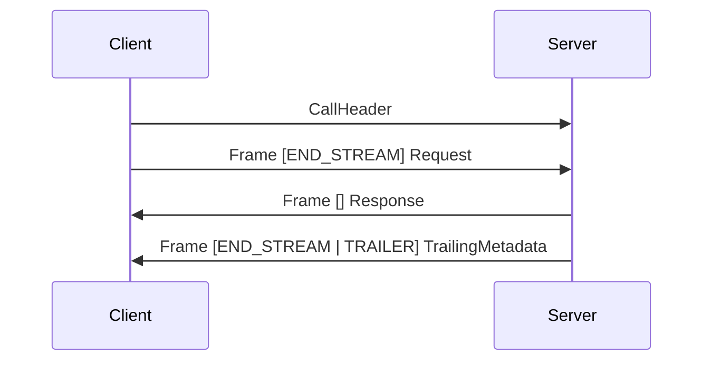
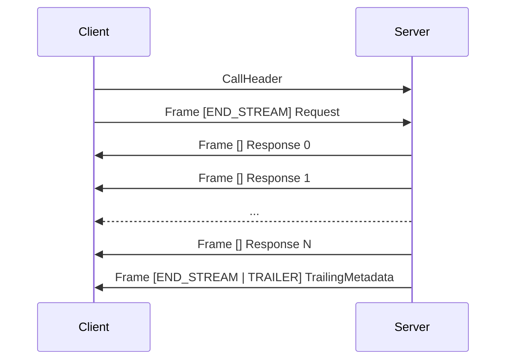
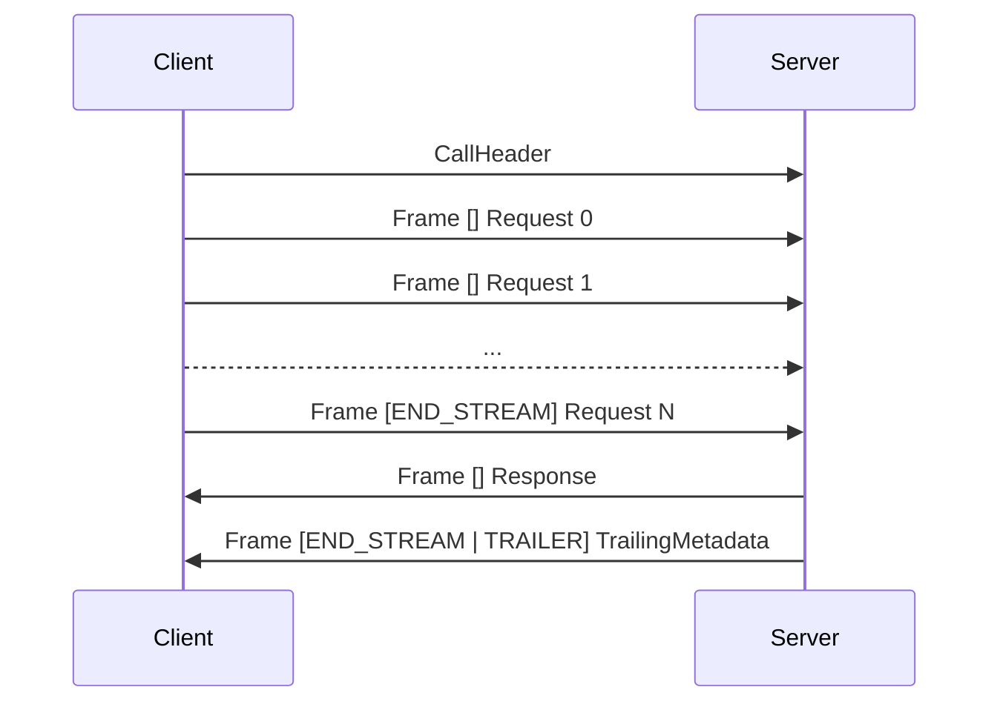
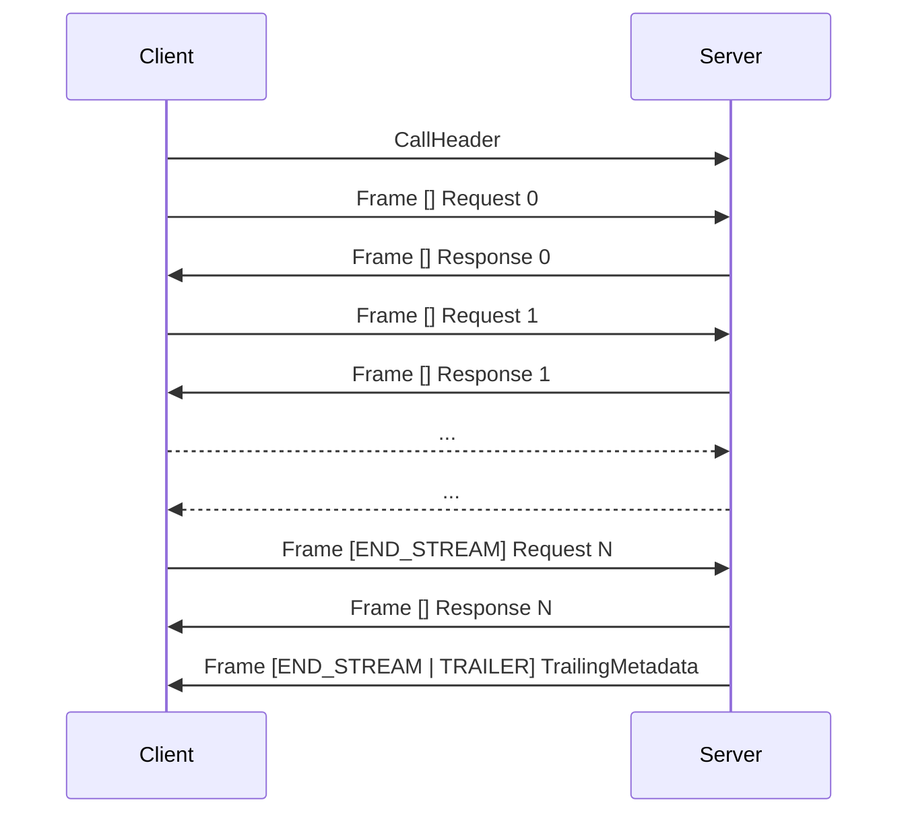

# Bebop RPC

Wire protocol for Bebop service methods. Every byte on the wire is Bebop-encoded: the call header, frame header, error payload, batch protocol, futures, and discovery response are all defined in `bebop/rpc.bop`. An implementation that can decode Bebop messages can decode every part of the RPC protocol. No separate IDL, no schema negotiation, no special-case parsing.

The key words "MUST", "MUST NOT", "SHOULD", "SHOULD NOT", and "MAY" in this document are to be interpreted as described in RFC 2119.

## 1. Schema

The full protocol is defined in one file. Types are grouped by the feature they support: core framing, discovery (method 0), batching (method 1), and futures (methods 2-4).

```bebop
edition = "2026"
package bebop

import "bebop/decorators.bop"
import "bebop/empty.bop"

enum StatusCode : byte {
    OK = 0;
    CANCELLED = 1;
    UNKNOWN = 2;
    INVALID_ARGUMENT = 3;
    DEADLINE_EXCEEDED = 4;
    NOT_FOUND = 5;
    PERMISSION_DENIED = 7;
    RESOURCE_EXHAUSTED = 8;
    UNIMPLEMENTED = 12;
    INTERNAL = 13;
    UNAVAILABLE = 14;
    UNAUTHENTICATED = 16;
}

@flags
enum FrameFlags : byte {
    NONE = 0;
    END_STREAM = 1;
    ERROR = 2;
    COMPRESSED = 4;
    TRAILER = 8;
    CURSOR = 16;
}

enum MethodType : byte {
    UNARY = 0;
    SERVER_STREAM = 1;
    CLIENT_STREAM = 2;
    DUPLEX_STREAM = 3;
}

struct FrameHeader {
    length: uint32;
    flags: FrameFlags;
    stream_id: uint32;
}

message CallHeader {
    method_id(1): uint32;
    deadline(2): timestamp;
    metadata(3): map[string, string];
    cursor(4): uint64;
}

message RpcError {
    code(1): StatusCode;
    detail(2): string;
    metadata(3): map[string, string];
}

message TrailingMetadata {
    metadata(1): map[string, string];
}

struct MethodInfo {
    name: string;
    method_id: uint32;
    method_type: MethodType;
    request_type_url: string;
    response_type_url: string;
}

struct ServiceInfo {
    name: string;
    methods: MethodInfo[];
}

struct DiscoveryResponse {
    services: ServiceInfo[];
}

struct BatchCall {
    call_id: int32;
    method_id: uint32;
    payload: byte[];
    input_from: int32;
}

struct BatchRequest {
    calls: BatchCall[];
    metadata: map[string, string];
}

struct BatchSuccess {
    payloads: byte[][];
    metadata: map[string, string];
}

union BatchOutcome {
    Success(1): BatchSuccess;
    Error(2): RpcError;
}

struct BatchResult {
    call_id: int32;
    outcome: BatchOutcome;
}

struct BatchResponse {
    results: BatchResult[];
}

message FutureDispatchRequest {
    method_id(1): uint32;
    payload(2): byte[];
    idempotency_key(3): uuid;
    metadata(4): map[string, string];
    deadline(5): timestamp;
    discard_result(6): bool;
}

struct FutureHandle {
    id: uuid;
}

message FutureResolveRequest {
    ids(1): uuid[];
}

struct FutureSuccess {
    payload: byte[];
    metadata: map[string, string];
}

union FutureOutcome {
    Success(1): FutureSuccess;
    Error(2): RpcError;
}

struct FutureResult {
    id: uuid;
    outcome: FutureOutcome;
}

struct FutureCancelRequest {
    id: uuid;
}
```

## 2. Terminology

| Term | Meaning |
|------|---------|
| **call** | One RPC invocation: a request and response exchange for a single method. |
| **frame** | A `FrameHeader` followed by a Bebop-encoded payload. The atomic unit on the wire. |
| **stream** | Ordered sequence of frames in one direction within a call. |
| **method ID** | 32-bit routing key computed from `/ServiceName/MethodName` at compile time. 4 bytes instead of a variable-length string, integer comparison instead of string comparison. On HTTP, the URL path provides human-readable routing and the server hashes it to get the method ID. See section 21 for the hash algorithm. |
| **call header** | `CallHeader` message sent once at the start of a binary call. Carries the method ID, optional deadline, metadata, and cursor. |
| **deadline** | Absolute point in time after which the caller abandons the call. |
| **metadata** | String key-value pairs carried alongside a call. |
| **cursor** | Opaque resume position for server-stream calls. Lets a client pick up where it left off after a disconnect. |
| **future** | Server-side handle for work dispatched to run in the background. The client gets back a UUID immediately and receives the result later over a resolve stream. |

## 3. Method types

Four calling conventions, matching the `stream` keyword in service definitions:

| Type | Schema syntax | Request | Response |
|------|--------------|---------|----------|
| Unary | `Method(Req): Resp` | 1 message | 1 message |
| Server streaming | `Method(Req): stream Resp` | 1 message | N messages |
| Client streaming | `Method(stream Req): Resp` | N messages | 1 message |
| Duplex streaming | `Method(stream Req): stream Resp` | N messages | N messages |

## 4. Status codes

Every completed call has a status. Code 0 is success. All others are errors. Codes 0-16 match gRPC numbering so bridging implementations can pass codes through without remapping. Codes 6, 9-11, and 15 are reserved to stay compatible with future gRPC additions. Codes 17-255 are available for application-specific errors.

| Code | Name | When to use |
|------|------|-------------|
| 0 | OK | Call succeeded. |
| 1 | CANCELLED | Caller cancelled before completion. |
| 2 | UNKNOWN | Error that doesn't fit another code. |
| 3 | INVALID_ARGUMENT | Malformed or invalid request. Not retryable without fixing the input. |
| 4 | DEADLINE_EXCEEDED | Deadline passed before the server produced a response. |
| 5 | NOT_FOUND | Method or service does not exist. |
| 7 | PERMISSION_DENIED | Caller is authenticated but not authorized. |
| 8 | RESOURCE_EXHAUSTED | Rate limit, quota, or backpressure. Retryable after backing off. |
| 12 | UNIMPLEMENTED | Method exists in the schema but the server has no handler. |
| 13 | INTERNAL | Server-side bug. |
| 14 | UNAVAILABLE | Transient. Service is down or overloaded. Retry with backoff. |
| 16 | UNAUTHENTICATED | Missing or invalid credentials. |

## 5. Frames

A frame is a 9-byte `FrameHeader` followed by a payload. Binary transports use frames even for unary calls. The cost is 18 bytes per round trip (9 each direction). The benefit: the ERROR flag handles error signaling uniformly, so success and failure share the same framing. Without this, a binary transport would need a separate mechanism to tell a response apart from an error.

HTTP unary calls skip framing entirely because HTTP already provides request/response boundaries and status codes.

```
+------------------+---------------+-------------------+-----------------+-----------------+
| length (uint32)  | flags (byte)  | stream_id (uint32)| payload         | cursor (uint64) |
|                  |               |                   | (length bytes)  | if CURSOR set   |
+------------------+---------------+-------------------+-----------------+-----------------+
```

| Field | Offset | Size | Encoding |
|-------|--------|------|----------|
| length | 0 | 4 | Payload byte count, uint32 little-endian. |
| flags | 4 | 1 | `FrameFlags` bitfield. |
| stream_id | 5 | 4 | uint32 little-endian. |

`FrameHeader` is a Bebop struct: no tags, no length prefix, fields in declaration order. Parse it by reading exactly 9 bytes.

### 5.1. Flags

| Value | Name | Meaning |
|-------|------|---------|
| 0x01 | END_STREAM | Last frame in this direction. No more frames will follow from this sender. |
| 0x02 | ERROR | Payload is an `RpcError`. MUST combine with END_STREAM. |
| 0x04 | COMPRESSED | Payload is compressed. Algorithm negotiated via metadata. |
| 0x08 | TRAILER | Payload is a `TrailingMetadata`. MUST combine with END_STREAM. |
| 0x10 | CURSOR | 8 bytes of little-endian uint64 follow the payload. `length` counts payload bytes only. See section 11. |

Remaining bits (0x20 and above) are reserved. Senders MUST set them to 0. Receivers MUST ignore them.

Invalid combinations:

- ERROR without END_STREAM
- TRAILER without END_STREAM
- ERROR and TRAILER both set (error metadata goes inside `RpcError.metadata`)

Receivers SHOULD treat these as protocol errors and close the connection.

Flags combine with bitwise OR. A frame ending a stream with an error: `END_STREAM | ERROR` = `0x03`. A frame with trailing metadata: `END_STREAM | TRAILER` = `0x09`.

### 5.2. Stream identifiers

Stream IDs exist for transports that multiplex calls over one connection. Most transports provide their own multiplexing (HTTP/2 streams, separate WebSocket connections) and should use stream ID 0.

Non-zero values identify a call within a multiplexed connection. Each call gets a unique stream ID for its lifetime. Assignment rules depend on the transport binding.

### 5.3. Error frames

When ERROR is set, the payload is a Bebop-encoded `RpcError` message. The `metadata` field carries any response metadata the handler set before the error. Omit it when there is none.

Example: `NOT_FOUND` with detail `"GreeterService.Helloo"`:

```
frame header (9 bytes):
1f 00 00 00       // length = 31
03                // flags = END_STREAM | ERROR
00 00 00 00       // stream_id = 0

payload (31 bytes, RpcError message encoding):
1e 00 00 00       // message length = 30 bytes
01                // tag 1 (code)
05                // StatusCode.NOT_FOUND = 5
02                // tag 2 (detail)
15 00 00 00       // string length = 21
47 72 65 65 74 65 72 53 65 72 76 69 63 65 2e 48 65 6c 6c 6f 6f  // "GreeterService.Helloo"
00                // NUL terminator
00                // end marker
```

## 6. Call header

The `CallHeader` message initiates a call on binary transports. The client sends it as the first bytes on the connection (or the first binary message on WebSocket). On HTTP, call header fields map to HTTP mechanisms (URL path, headers) and no `CallHeader` is sent.

| Field | Description |
|-------|-------------|
| `method_id` | MurmurHash3 of `/ServiceName/MethodName`. Routes to the handler. |
| `deadline` | Absolute timestamp. Omit for no deadline. Bebop `timestamp` type (16 bytes: int64 seconds + int32 nanoseconds since Unix epoch + int32 UTC offset in milliseconds). |
| `metadata` | Key-value pairs. Keys and values are UTF-8 strings. |
| `cursor` | Stream resume position. 0 or omitted means start from the beginning. See section 11. |

The call header is a Bebop message with a uint32 length prefix. After the call header, everything is frames.

## 7. Call lifecycle

### 7.1. Unary



Given:

```bebop
struct HelloRequest  { name: string; }
struct HelloResponse { greeting: string; }
```

A call to method ID `0x1a2b3c4d` with `HelloRequest { name: "Alice" }` returning `HelloResponse { greeting: "Hello, Alice!" }`:

```
client -> CallHeader (message encoding):
  06 00 00 00                            // message length = 6
  01                                     // tag 1 (method_id)
  4d 3c 2b 1a                           // uint32 0x1a2b3c4d
  00                                     // end marker

client -> request frame:
  0a 00 00 00                            // length = 10
  01                                     // flags = END_STREAM
  00 00 00 00                            // stream_id = 0
  05 00 00 00                            // string length = 5
  41 6c 69 63 65 00                      // "Alice" + NUL

server -> response frame:
  12 00 00 00                            // length = 18
  01                                     // flags = END_STREAM
  00 00 00 00                            // stream_id = 0
  0d 00 00 00                            // string length = 13
  48 65 6c 6c 6f 2c 20 41 6c 69 63 65   // "Hello, Alice!"
  21 00                                  // "!" + NUL

total: 10 + 19 + 27 = 56 bytes
```

The trailer frame is optional. If the server has no response metadata, the response frame carries END_STREAM directly (as shown above). On error, the server sends one frame with `END_STREAM | ERROR` containing an `RpcError` payload.

On HTTP, the call header is implicit (URL path + headers) and request/response bodies are bare Bebop payloads without framing. See section 17.

### 7.2. Server streaming



Client sends the call header and one request frame with END_STREAM. Server sends zero or more response frames, then ends with a trailer frame or sets END_STREAM on the last response frame.

### 7.3. Client streaming



Client sends the call header and zero or more request frames, with END_STREAM on the last. Server waits for the client to finish, then sends one response frame and an optional trailer.

The server MAY send its response before the client finishes. This signals early termination: the client SHOULD stop sending and the server SHOULD discard further request frames.

### 7.4. Duplex streaming



Both sides send frames independently. Request and response frames are not correlated. Either side signals completion with END_STREAM.

## 8. Metadata

String key-value pairs carried alongside a call. Keys and values are UTF-8 strings (they're standard Bebop `string` fields on the wire), but keys SHOULD be restricted to ASCII lowercase letters, digits, hyphens, and underscores. Keys starting with `bebop-` are reserved for protocol use.

### 8.1. Request metadata

Sent once at the start of a call. On binary transports, carried in `CallHeader.metadata`. On HTTP, mapped to request headers.

### 8.2. Response metadata (trailing)

Response metadata is trailing because the server usually doesn't have it at call start. Cache hit/miss, row counts, pagination tokens, trace IDs: all of these emerge during or after processing.

On binary transports, the server sends a TRAILER frame (`END_STREAM | TRAILER`) with a `TrailingMetadata` payload after the last data frame. On HTTP, trailing metadata maps to HTTP trailers (HTTP/2) or response headers for unary calls. On error, response metadata goes in `RpcError.metadata`. No separate trailer frame.

gRPC splits response metadata into headers (sent before the first response byte) and trailers (sent after). Bebop has only trailing metadata. A server cannot send metadata to the client before the handler finishes, but this eliminates an entire class of ordering bugs and simplifies transport implementations.

### 8.3. Reserved keys

| Key | Description |
|-----|-------------|
| `bebop-encoding` | Payload compression: `identity` (default), `gzip`, `zstd`, `lz4`. |
| `bebop-accept-encoding` | Accepted compression algorithms, comma-separated. |

## 9. Deadlines

Relative timeouts accumulate error across hops. If service A gives service B a 5-second timeout, and B spends 3 seconds then gives service C a new 5-second timeout, C thinks it has 5 seconds when A expects the whole chain done in 2. Every hop drifts further. Bebop avoids this by using absolute timestamps. A 5-second timeout becomes `now + 5s` as an absolute time. Every downstream hop checks the same wall-clock deadline without accumulating jitter.

On binary transports, the deadline is `CallHeader.deadline` (Bebop `timestamp`, 16 bytes: int64 seconds since epoch, int32 nanoseconds, int32 UTC offset in milliseconds). On HTTP, the deadline is the `bebop-deadline` header with a decimal millisecond Unix timestamp.

If the deadline has passed when the server receives the call, it MUST return DEADLINE_EXCEEDED without invoking the handler.

Servers MUST propagate deadlines to downstream calls. When making a downstream call, use the earlier of the propagated deadline and any locally configured timeout. Never extend a caller's deadline.

## 10. Cancellation

### 10.1. Client behavior

To cancel an in-flight call, the client closes its send direction for that call:

| Transport | How to cancel |
|-----------|---------------|
| Binary (TCP, IPC) | Close the connection, or send END_STREAM on the request stream without waiting for the response. |
| WebSocket | Send a close frame, or close the connection. |
| HTTP/1.1 | Abort the request (close the TCP connection). |
| HTTP/2 | Send RST_STREAM on the HTTP/2 stream. |
| Multiplexed binary | Send END_STREAM on the call's stream ID. Other calls on the same connection are unaffected. |

Clients SHOULD NOT expect a response after cancelling.

### 10.2. Server behavior

Servers MUST detect cancellation and propagate it to handlers. The mechanism depends on the transport:

- **Connection closed**: the server's read or write fails. Treat as cancellation.
- **HTTP/2 RST_STREAM**: the server receives a stream reset. Treat as cancellation.
- **END_STREAM received early**: during client streaming or duplex streaming, the client may send END_STREAM before the server expects it. This is normal completion, not cancellation. Cancellation means the client does not want the response. END_STREAM means the client is done sending but still wants the response.

When the server detects cancellation:

1. Set the cancellation flag on the call context (`isCancelled` returns true).
2. Stop reading from the request stream.
3. Stop writing to the response stream.
4. Clean up resources.
5. Do not send an error frame. The client already disconnected.

Handlers SHOULD check `isCancelled` periodically during long operations.

### 10.3. Cancellation and deadlines

When a deadline passes, the server SHOULD treat it like cancellation, with one difference: if the server can still send, it SHOULD send DEADLINE_EXCEEDED before closing. The client may still be connected and waiting.

Both cancellation and deadline expiry are surfaced through `RpcContext.isCancelled`. Handlers do not need to distinguish between them.

## 11. Cursors

Server-stream calls break when the connection drops. Without cursors, the client's only option is to re-request the entire stream from scratch and skip past data it already received. This wastes bandwidth and forces the client to track how far it got.

Cursors fix this at the protocol level in both directions. The client sends a resume position in `CallHeader.cursor`. The server attaches position markers to individual response frames using the CURSOR flag. Both values are opaque uint64s. What a cursor means is handler-specific: a database offset, a sequence number, a timestamp, a log position. The protocol does not interpret the value.

### 11.1. Per-frame cursors

When the CURSOR flag (0x10) is set on a frame, 8 bytes of little-endian uint64 follow the payload. The `length` field still counts payload bytes only.

```
┌──────────┬───────┬───────────┬──────────────────┬──────────────┐
│ length   │ flags │ stream_id │ payload          │ cursor (8B)  │
│ (uint32) │ (byte)│ (uint32)  │ (length bytes)   │ LE uint64    │
└──────────┴───────┴───────────┴──────────────────┴──────────────┘
         9-byte header          └ length bytes ┘
```

Not every response frame needs a cursor. Frames without the CURSOR flag carry no position information. A stream may mix cursored and non-cursored frames.

### 11.2. Flow

First call (no cursor, or cursor = 0):

```
Client -> CallHeader { method_id: 0x1234, cursor: 0 }
Client -> Frame [END_STREAM] Request
Server -> Frame [CURSOR] Response 0    // cursor=100
Server -> Frame [CURSOR] Response 1    // cursor=200
Server -> Frame [CURSOR] Response 2    // cursor=300
         *** connection drops ***
```

The client reads the cursor from each frame as it arrives. The last cursor fully processed is 200.

Reconnection:

```
Client -> CallHeader { method_id: 0x1234, cursor: 200 }
Client -> Frame [END_STREAM] Request
Server -> Frame [CURSOR] Response 2    // resumes from 200, cursor=300
Server -> Frame [CURSOR] Response 3    // cursor=400
...
Server -> Frame [END_STREAM]
```

The handler reads `RpcContext.cursor` and skips past already-delivered data.

### 11.3. Rules

The resume cursor lives in `CallHeader`, not in the request payload. Per-frame cursors live on the wire frame, not in application types. Resume logic stays out of application message types entirely.

Per-frame cursors apply to server-stream and duplex-stream response frames. For unary calls, the `CallHeader.cursor` field is ignored.

Batches do not propagate cursors. Each call within a batch starts with cursor = 0 regardless of the parent call's cursor. Dispatched futures likewise start with cursor = 0.

Handlers that don't support resumption ignore the cursor field and never set per-frame cursors.

## 12. Authentication

Not defined by this protocol. Credentials travel as metadata. How the server verifies them is an implementation decision.

A client attaches credentials by setting a metadata key (e.g., `authorization`). The server reads the key and returns UNAUTHENTICATED (16) if the credential is missing or invalid, or PERMISSION_DENIED (7) if the credential is valid but insufficient. Interceptors (section 16.6) are the natural place to verify credentials and populate the authenticated identity.

### 12.1. Peer information

Transports attach peer information to the call context: the remote address, local address, and an optional authenticated identity. Peer information is available to interceptors and handlers via typed context attachments (section 16.5).

The authenticated identity is a stable string that identifies the caller across reconnections. The same credentials MUST produce the same identity string. What that string contains depends on the auth mechanism: a subject from a TLS client certificate, a user ID from a verified JWT, a uid from Unix socket credentials, or anything else the transport can verify. The protocol does not define the format.

Transports and interceptors populate the identity. A TLS transport might set it from the client certificate at connection time. An interceptor might read a token from metadata, validate it, and set the identity on the context. Either approach works. The protocol only requires that the identity, once set, is stable and consistent for a given set of credentials.

Futures use peer information for ownership enforcement (section 14.6).

## 13. Batching

Consider a mobile client that needs to create a widget, then fetch the created widget's details, then load the user's settings. That's three round trips. On a cellular connection with 200ms latency, the user waits 600ms before seeing anything.

Method ID 1 is reserved for batch calls. A batch combines multiple unary and server-stream calls into a single round trip. The client sends a `BatchRequest`, the server executes all calls, and returns a `BatchResponse` with per-call results.

On binary transports, this is a unary call to method ID 1. On HTTP: `POST /_bebop/batch` with content type `application/bebop`.

### 13.1. Pipelining

The interesting part: `input_from`. Each `BatchCall` either supplies its own payload or references a previous call's result. When `input_from` is >= 0, the server uses the first payload from the referenced call's `BatchSuccess` as the request bytes. When `input_from` is -1, the call uses its own payload.

Without `input_from`, the client would need separate round trips whenever call B depends on call A's result. With it, the server resolves dependencies internally.

```
Batch request:
  call_id=0  method=CreateWidget   payload=<encoded CreateWidgetRequest>
  call_id=1  method=GetWidget      input_from=0
  call_id=2  method=GetSettings    payload=<encoded GetSettingsRequest>

Execution:
  Layer 0: CreateWidget (call 0) and GetSettings (call 2) run in parallel
  Layer 1: GetWidget (call 1) runs after call 0, using its response as input

Batch response:
  call_id=0  Success { payloads: [<CreateWidgetResponse bytes>] }
  call_id=1  Success { payloads: [<GetWidgetResponse bytes>] }
  call_id=2  Success { payloads: [<GetSettingsResponse bytes>] }
```

Three calls, one round trip. The dependent call runs automatically once its dependency finishes.

### 13.2. Execution model

The server MUST:

1. **Validate** all calls before executing any. Reject the entire batch with INVALID_ARGUMENT if any `call_id` is negative, if there are duplicate `call_id` values, or if `input_from` references a `call_id` that doesn't appear earlier in the list.

2. **Build a dependency graph** from `input_from` references. Calls with `input_from = -1` have no dependencies and form the first execution layer.

3. **Execute each layer in parallel**. All calls within a layer MUST run concurrently. Calls in later layers wait for their dependencies to complete. Sequential execution of independent batch calls is a conformance violation.

4. **Propagate failures**. If a call fails, all calls that depend on it via `input_from` also fail with INVALID_ARGUMENT and the detail `"dependency {call_id} failed"`.

5. **Respect the deadline**. If the batch's deadline expires mid-execution, remaining calls SHOULD fail with DEADLINE_EXCEEDED. Completed calls keep their results.

### 13.3. Server-stream calls in batches

Batches support server-stream methods. The server collects all stream elements into an array: `BatchSuccess.payloads` contains one element for unary results, all buffered elements for server-stream results.

This is a deliberate tradeoff. True streaming semantics inside a batch would require multiplexing the batch response. If a server-stream method produces large volumes of data, call it directly outside a batch.

`BatchResponse` contains one `BatchResult` per call, in the same order as the request.

Client-stream and duplex methods are not supported in batches. If a `BatchCall` targets one, its result is an error with code INVALID_ARGUMENT.

## 14. Futures

Some work takes too long for a synchronous call. ML inference, media transcoding, batch data processing: the client shouldn't hold a connection open for minutes waiting on a response. Polling wastes bandwidth. Webhooks add operational complexity.

Futures solve this with three reserved method IDs:

| ID | Method | Type | Request | Response |
|----|--------|------|---------|----------|
| 2 | Dispatch | unary | `FutureDispatchRequest` | `FutureHandle` |
| 3 | Resolve | server-stream | `FutureResolveRequest` | `FutureResult` |
| 4 | Cancel | unary | `FutureCancelRequest` | `bebop.Empty` |

The client dispatches work and gets back a UUID immediately. A long-lived resolve stream pushes results as futures complete. No polling.

### 14.1. Dispatch

A `FutureDispatchRequest` wraps any unary call (or batch) for background execution. The server registers the work, spawns a task, and returns a `FutureHandle` containing a server-generated UUID.

```
Client -> unary(method=2) FutureDispatchRequest {
    method_id: 0x1234,                        // the inner method to run
    payload: <encoded request>,
    idempotency_key: "a1b2c3d4-...",           // client-generated UUID, or omit for no dedup
    metadata: {"auth": "tok"},                 // forwarded to inner call
    deadline: <timestamp>,                     // deadline for inner call, not for dispatch
    discard_result: true                      // discard result after delivery, or omit for default retention
}

Server -> FutureHandle { id: "550e8400-..." }
```

The dispatch call itself returns quickly. The deadline in the request applies to the inner call's execution, not to the dispatch RPC. The dispatch RPC uses the deadline from the outer `CallHeader`, if any.

Only unary methods and batches can be dispatched. Server-stream methods have cursor-based resumption for long-running work. Client-stream and duplex methods are interactive and don't make sense as fire-and-forget operations. Dispatching a reserved method (dispatch, resolve, or cancel) returns INVALID_ARGUMENT.

Handlers don't know they're running as futures. The dispatch is transparent: the server calls the handler the same way it would for a synchronous unary call. The handler reads `RpcContext`, does its work, and returns a response.

### 14.2. Idempotency

Network failures happen between dispatch and receiving the handle. The client retries, but now the server might run the same work twice.

The `idempotency_key` field (uuid, omit for no dedup) prevents this. If a pending or completed future with the same key exists for the same caller, the server returns the existing handle instead of dispatching again. The client generates the key. After cancellation, the key is released and a retry with the same key creates a new future.

Idempotency keys are scoped to the caller. Two different callers can use the same key without collision. See section 14.6 for how caller identity works.

### 14.3. Resolve

The resolve stream (method ID 3) is a long-lived server-stream connection. The server pushes `FutureResult` messages as futures complete. Each result contains the future's UUID and its terminal outcome: success with a wire-encoded response payload and metadata, or an error.

```
Client -> serverStream(method=3) FutureResolveRequest {
    ids: []   // omit or empty = subscribe to all futures
}

Server -> FutureResult { id: "550e8400-...", outcome: Success { payload: <bytes>, metadata: {...} } }
Server -> FutureResult { id: "661f9511-...", outcome: Error { code: INTERNAL, detail: "..." } }
...
```

The `ids` field filters which futures the client wants results for. Omitting it subscribes to all futures owned by the caller. When specific IDs are provided, the server pushes any already-completed results immediately, then continues pushing as remaining futures finish. The server only pushes results for futures the caller owns. See section 14.6.

On reconnection, the client opens a new resolve stream. If the client passes IDs of still-pending futures, the server replays any that completed while the client was disconnected (assuming the server hasn't evicted them). See section 14.8 for result retention requirements.

### 14.4. Cancel

Method ID 4. Send a `FutureCancelRequest` with the future's UUID. The server verifies the caller owns the future, then signals cancellation to the running task via the call context's cancellation mechanism (`RpcContext.isCancelled`). Returns `bebop.Empty`. If the caller does not own the future, the server returns PERMISSION_DENIED.

Cancellation is best-effort. The inner call may have already completed. The server does not guarantee the future is cancelled on return; it only guarantees the signal was delivered.

### 14.5. Batch dispatch

Batches can be dispatched as futures. The `FutureDispatchRequest` wraps the batch: `method_id` is 1 (the batch reserved method), `payload` is the wire-encoded `BatchRequest`. The server runs the entire batch in the background. The future resolves with a `BatchResponse`.

Batches can also contain server-stream calls, which are collected into arrays as usual. The entire batch, including collected stream elements, completes as a single future.

### 14.6. Future IDs and ownership

Future IDs are server-generated v4 UUIDs using a cryptographically secure random number generator. UUIDs alone are not sufficient to resolve or cancel a future. Every future is bound to a caller identity, and all subsequent operations (resolve, cancel) are checked against that identity.

The server resolves caller identity in order:

1. **Authenticated identity** from peer information (section 12.1). If the transport or an interceptor has verified credentials and set an identity string, that string is the owner.
2. **Remote address** from peer information. If no auth is configured, the connection's remote address is the owner. Futures are then scoped per connection rather than per peer.
3. **UNAUTHENTICATED**. If peer information has neither an identity nor a remote address, the server rejects the call.

The dispatch call records this identity as the future's owner. Resolve streams only push results for futures the caller owns. Cancel calls reject with PERMISSION_DENIED if the caller doesn't own the target future.

The ownership check is transparent to handlers. The router enforces it before the inner call runs.

### 14.7. Rehydration

After a reconnect or app restart, a client can rehydrate a future from a saved UUID without re-dispatching. Open a resolve stream with the saved ID. If the future has already completed and the server still has the result, it arrives immediately. If the future is still running, the result arrives when it finishes.

### 14.8. Retention

Servers MUST support configurable result retention for completed futures. The server's retention policy sets the default behavior for all futures.

The client can override retention per-dispatch by setting `discard_result` to true in `FutureDispatchRequest`. When set, the server delivers the result to active resolve streams and immediately discards it. The server still returns a handle — the client may need the ID for cancellation while the work is in progress. Rehydration (14.7) is unavailable for fire-and-forget futures because there is no stored result to replay. Idempotency keys still work: the server can dedup a retried dispatch even if it won't retain the result.

When `discard_result` is omitted or false, the server applies its configured retention policy. The client cannot force the server to retain a result longer than the server's policy allows.

### 14.9. Storage

The protocol makes no assumptions about how future state is persisted. Server implementations MUST define an asynchronous storage interface so that backends (in-memory, database, disk, tiered cache) are pluggable.

The default implementation MAY be in-memory.

## 15. Service discovery

Method ID 0 is reserved for service discovery. Request type is `bebop.Empty` (zero bytes). Response type is `DiscoveryResponse`, listing all registered services and their methods with type information and type URLs.

Servers that support discovery handle method ID 0 like any unary call. Servers that do not MUST return UNIMPLEMENTED.

Most clients never call this. Generated code knows the schema at compile time. Discovery exists for tooling: CLI debuggers, service meshes, API gateways, and anything else that needs to inspect a running server's capabilities without prior knowledge of its schema.

## 16. Call context

`RpcContext` is a concrete class that flows through the entire call chain: client to transport to router to interceptor to handler to downstream stubs.

| Field | Mutability | Description |
|-------|-----------|-------------|
| `metadata` | Read-only | Request metadata from `CallHeader.metadata` or HTTP headers. |
| `responseMetadata` | Write | Trailing metadata sent after the handler returns. |
| `deadline` | Read-only | When the call expires. Nil if no deadline was set. |
| `isCancelled` | Read-only | True when the client disconnected or the deadline expired. |
| `cursor` | Read-only | Stream resume position from `CallHeader.cursor`. 0 if not set. |
| `attachments` | Read/write | Typed key-value storage for transport-specific data. |

### 16.1. Why one context type

gRPC stores incoming and outgoing metadata in separate hidden slots of a general-purpose `context.Context`. Reading the wrong direction is a silent bug: `FromOutgoingContext` on the server returns nothing instead of failing. Bebop avoids this by making direction structural. `context.metadata` is always what was received. `context.responseMetadata` is always what the handler is sending back. For downstream calls, the handler derives a new context. There is no "outgoing metadata" slot on the current context that could be confused with the incoming one.

### 16.2. Context lifecycle

```
Client                          Wire                     Server
──────                          ────                     ──────
RpcContext(metadata: md)
  │
  ├─ metadata    ──────────▶  CallHeader.metadata  ──▶  RpcContext.metadata
  ├─ deadline    ──────────▶  CallHeader.deadline  ──▶  RpcContext.deadline
  ├─ cursor      ──────────▶  CallHeader.cursor    ──▶  RpcContext.cursor
  │                                                      │
  │                                                      ├─ router dispatches
  │                                                      ├─ interceptors run
  │                                                      ├─ handler executes
  │                                                      │    reads context.metadata
  │                                                      │    calls context.setResponseMetadata(k, v)
  │                                                      │
  │                          TrailingMetadata       ◀──  RpcContext.responseMetadata
  │                          (or RpcError.metadata)
  ▼
Response(value, transportMeta)
```

The client creates an `RpcContext` with metadata, an optional deadline, and an optional cursor. The transport encodes these into the `CallHeader` on the wire. The server constructs a new `RpcContext` from the received call header, populates transport-specific state in `attachments`, and passes it through the router and interceptor chain to the handler.

The handler reads `context.metadata` for incoming request metadata and calls `context.setResponseMetadata(key, value)` to attach response metadata. After the handler returns, the transport reads `context.responseMetadata` and sends it as trailing metadata (TRAILER frame on binary transports, HTTP trailers or response headers on HTTP).

On error, response metadata goes in `RpcError.metadata`. No separate trailer frame.

### 16.3. Metadata propagation

Metadata does not propagate automatically. A handler that calls a downstream service must explicitly choose what to forward. The default is safe: calling a downstream service with no context argument sends empty metadata. This prevents accidental credential leakage across service boundaries.

```
                     Handler
                    ┌────────────────────────────┐
incoming context ──▶│ context.metadata            │
                    │   ["auth": "bearer xyz",    │
                    │    "x-trace-id": "abc"]      │
                    │                              │
                    │ // Forward everything        │
                    │ downstream.call(             │
                    │   ctx: context.forwarding()) │──▶ metadata: ["auth":..., "x-trace-id":...]
                    │                              │
                    │ // Forward + add keys        │
                    │ downstream.call(             │
                    │   ctx: context.deriving(     │
                    │     appending: ["caller":    │
                    │       "widget-svc"]))        │──▶ metadata: ["auth":..., "x-trace-id":..., "caller":...]
                    │                              │
                    │ // Fresh context             │
                    │ downstream.call(             │
                    │   ctx: RpcContext(metadata:  │
                    │     ["service": "widget"]))  │──▶ metadata: ["service": "widget"]
                    │                              │
                    │ // No context (default)      │
                    │ downstream.call(request)     │──▶ metadata: [:]
                    └────────────────────────────┘
```

Three derivation methods:

- `context.forwarding()` — copy metadata, deadline, and cursor. Use when the downstream call acts on behalf of the original caller.
- `context.deriving(appending: [...])` — copy metadata, deadline, and cursor, then merge extra keys. New keys override existing ones.
- `RpcContext(metadata: [...])` — start clean. Nothing from the incoming call propagates.

Deadlines propagate with `forwarding()` and `deriving(appending:)`. Servers MUST use the earlier of the propagated deadline and any locally configured timeout. See section 9.

### 16.4. Batch context

In a batch, all calls share the batch-level metadata from `BatchRequest.metadata`. Each call gets its own `RpcContext` so handlers can set response metadata independently. Cursors are not propagated to batch calls; each starts at 0.

When a call depends on another via `input_from`, the upstream call's response metadata merges into the downstream call's request metadata:

```
BatchRequest.metadata: ["auth": "token"]

call 0: CreateWidget  ──▶  context.metadata = ["auth": "token"]
                            handler sets context.setResponseMetadata("widget-id", "42")
                            │
                            ▼ success
call 1: GetWidget      ──▶  context.metadata = ["auth": "token", "widget-id": "42"]
         (input_from=0)                          ↑ merged from call 0's response metadata
```

This lets pipelined calls pass context without the client knowing intermediate values. Last-writer-wins: upstream response metadata keys override batch metadata keys.

### 16.5. Transport-specific access

Transports store per-call state in the context's attachments. Each attachment is a typed key conforming to `AttachmentKey`, which associates a key type with its value type at compile time:

```
protocol AttachmentKey {
    associatedtype Value: Sendable
}
```

Transport packages define keys and convenience accessors:

```
// In the HTTP transport package
enum HttpRequestKey: AttachmentKey {
    typealias Value = HttpRequest
}

extension RpcContext {
    var httpRequest: HttpRequest? { self[HttpRequestKey.self] }
}

// Handler reads transport state
func sayHello(request: HelloRequest, context: RpcContext) -> HelloResponse {
    if let req = context.httpRequest {
        context.setResponseMetadata("Cache-Control", "max-age=60")
    }
    // ...
}
```

The subscript `context[K.self]` returns `K.Value?`, so the compiler enforces that a key always maps to the correct type. No runtime casts.

Handlers that use only core `RpcContext` APIs work on every transport. Handlers that read transport-specific attachments only work on the transport that populates those keys.

### 16.6. Interceptors

Interceptors wrap handler dispatch. They receive the method ID and `RpcContext`, and decide whether to proceed or reject the call.

```
func intercept(methodId: UInt32, ctx: RpcContext, proceed: () async throws -> Void) async throws {
    let traceId = ctx.metadata["x-trace-id"] ?? generateTraceId()
    ctx.setResponseMetadata("x-trace-id", traceId)
    try await proceed()
}
```

Interceptors run in registration order. The first registered interceptor is the outermost. Interceptors can short-circuit by throwing an error instead of calling `proceed`.

Interceptors read and write the same `RpcContext` the handler receives. Response metadata set by an interceptor is visible to the transport alongside metadata set by the handler.

Interceptors run on reserved methods too: dispatch (2), resolve (3), and cancel (4) all pass through the interceptor chain before reaching the built-in handler. This lets you add auth, logging, or rate limiting to future operations.

## 17. Transport: HTTP

Maps Bebop RPC onto HTTP/1.1 and HTTP/2.

### 17.1. Routing

```
POST /{ServiceName}/{MethodName}
```

Path components use service and method names as they appear in the schema. Example: `POST /GreeterService/SayHello`. The server computes the method ID from the path by hashing it.

### 17.2. Content type

| Mode | Content-Type |
|------|-------------|
| Unary | `application/bebop` |
| Streaming | `application/bebop+stream` |

### 17.3. Metadata mapping

Metadata keys map to HTTP headers. Reserved keys already have the `bebop-` prefix.

```
bebop-deadline: 1739412345678
bebop-encoding: zstd
authorization: Bearer tok_abc123
x-request-id: abc-123
```

`bebop-deadline` is a decimal millisecond Unix timestamp.

### 17.4. Unary calls

Request body: bare Bebop-encoded request. Response body: bare Bebop-encoded response. No framing.

Success:

```
HTTP/1.1 200 OK
Content-Type: application/bebop
x-pagination-cursor: abc123

<response bytes>
```

Response metadata goes in HTTP response headers for unary calls.

Error:

```
HTTP/1.1 <mapped status>
Content-Type: application/bebop
bebop-status: <code>

<RpcError bytes>
```

`bebop-status` carries the status code for infrastructure that inspects headers without decoding the body.

Status code mapping:

| Bebop status | HTTP status |
|-------------|-------------|
| CANCELLED | 499 |
| INVALID_ARGUMENT | 400 |
| DEADLINE_EXCEEDED | 408 |
| NOT_FOUND | 404 |
| PERMISSION_DENIED | 403 |
| RESOURCE_EXHAUSTED | 429 |
| UNIMPLEMENTED | 501 |
| INTERNAL | 500 |
| UNAVAILABLE | 503 |
| UNAUTHENTICATED | 401 |
| UNKNOWN | 500 |

### 17.5. Streaming calls

HTTP response status is always `200`. The body is a sequence of frames. Errors are conveyed in ERROR frames, not via HTTP status.

Request body for server streaming: bare Bebop payload (one message). Request body for client streaming and duplex: a sequence of frames.

Trailing metadata on HTTP/2 maps to HTTP trailers. On HTTP/1.1, trailing metadata is sent as a TRAILER frame in the response body.

HTTP/1.1: use chunked transfer encoding. Each chunk SHOULD contain one or more complete frames.

HTTP/2: frames map to DATA frames. Bebop stream IDs SHOULD be 0.

Duplex streaming requires HTTP/2. Server streaming and client streaming work over HTTP/1.1.

### 17.6. Batch endpoint

```
POST /_bebop/batch
Content-Type: application/bebop

<BatchRequest bytes>
```

Response is a `BatchResponse`. Errors in individual calls are in the `BatchResult`, not in the HTTP status.

### 17.7. Futures endpoints

```
POST /_bebop/dispatch    // FutureDispatchRequest -> FutureHandle
POST /_bebop/resolve     // FutureResolveRequest -> stream FutureResult
POST /_bebop/cancel      // FutureCancelRequest -> Empty
```

Dispatch and cancel are unary. Resolve uses `application/bebop+stream` and follows server-stream conventions (section 17.5).

## 18. Transport: binary

For raw byte streams: WebSocket, TCP, Unix domain sockets, IPC channels, shared memory.

### 18.1. Call initiation

Client sends a Bebop-encoded `CallHeader` as the first bytes on the connection (or first binary message on WebSocket). The receiver reads 4 bytes for the length, then that many bytes, and decodes the `CallHeader`.

After the call header, everything is frames.

### 18.2. Unary calls

```
Client -> CallHeader
Client -> Frame { payload: <request>,  flags: END_STREAM }
Server -> Frame { payload: <response>, flags: END_STREAM }
```

With trailing metadata:

```
Client -> CallHeader
Client -> Frame { payload: <request>,  flags: END_STREAM }
Server -> Frame { payload: <response>, flags: NONE }
Server -> Frame { payload: <TrailingMetadata>, flags: END_STREAM | TRAILER }
```

### 18.3. Streaming calls

Same frame protocol as section 7. Every message in both directions is a frame with a 9-byte header.

### 18.4. WebSocket

Each WebSocket binary message carries exactly one protocol element:

1. First binary message: `CallHeader` bytes
2. Subsequent binary messages: one frame each (header + payload)

Stream IDs SHOULD be 0. Each WebSocket connection handles one call. Multiplex by opening multiple connections.

### 18.5. TCP and Unix sockets

Byte stream layout: `CallHeader`, then frames concatenated end-to-end. The receiver reads each frame by parsing the 9-byte header, then reading `length` bytes of payload.

For multiplexing over a single connection, use non-zero stream IDs. Client-initiated streams use odd IDs; server-initiated streams use even IDs.

### 18.6. IPC and shared memory

Same byte layout as TCP. Each transport-level message SHOULD contain one complete `CallHeader` or one complete frame.

## 19. Implementation requirements

### 19.1. Server: connection handling

The server MUST handle multiple concurrent connections. Each connection handles at least one call. On multiplexed transports, a single connection handles multiple concurrent calls identified by stream ID.

The server MUST NOT block one call waiting for another to complete, unless they are in the same batch with an `input_from` dependency.

### 19.2. Server: call dispatch

When a call arrives:

1. Parse the `CallHeader` (binary) or extract routing from HTTP path and headers.
2. Check the deadline. If already passed, return DEADLINE_EXCEEDED without invoking the handler.
3. Look up the method ID. If not found, return NOT_FOUND.
4. Verify the method type matches the calling convention. A unary method invoked as server-stream SHOULD return UNIMPLEMENTED.
5. Run interceptors, if any.
6. Invoke the handler.

### 19.3. Server: deadline enforcement

The server MUST track deadlines for every call that has one. When a deadline expires:

1. Set the cancellation flag on the call context.
2. Cancel the handler's task/coroutine if it hasn't returned.
3. Send DEADLINE_EXCEEDED if the response stream is still writable.
4. Clean up resources.

### 19.4. Server: error handling

If the handler throws an error:

- If the error is a `BebopRpcError` (or the language-specific equivalent), use its status code and detail.
- Otherwise, wrap it as INTERNAL with the error description as the detail. Do not leak stack traces to the client in production.

If the handler panics, return INTERNAL. One bad call MUST NOT crash the process.

### 19.5. Server: streaming

For server-stream calls, the server MUST:

- Send response frames as the handler produces them. Do not buffer all responses.
- Send END_STREAM after the handler finishes.
- If the handler fails mid-stream, send an ERROR frame.

For client-stream and duplex calls, the server MUST:

- Deliver request frames to the handler as they arrive.
- Apply backpressure if the handler falls behind. Do not buffer unbounded request data in memory.
- Handle END_STREAM as normal completion of the request stream, not cancellation.

### 19.6. Server: futures

When futures are enabled, the server MUST:

- Accept dispatch (method 2), resolve (method 3), and cancel (method 4) calls.
- Generate future IDs using a cryptographically secure random number generator.
- Record the caller identity (from peer information) as the future's owner at dispatch time.
- Propagate peer information to the inner call's context, so interceptors and handlers see the original caller's identity.
- Run dispatched work in background tasks independent of the dispatch call's connection.
- Push results on active resolve streams only when the subscriber owns the completed future.
- Enforce `FutureDispatchRequest.deadline` on the inner call, not on the dispatch call itself.
- Respect idempotency keys: if a pending or completed future has the same key for the same owner, return the existing handle. Return PERMISSION_DENIED if the key matches a future owned by a different caller.
- On cancel, verify the caller owns the future before signaling cancellation. Return PERMISSION_DENIED otherwise. Do not block waiting for the task to finish.

When futures are not enabled, the server MUST return UNIMPLEMENTED for method IDs 2, 3, and 4.

Result retention policy MUST be configurable. See section 14.8 for requirements including fire-and-forget mode. When `FutureDispatchRequest.discard_result` is true, the server MUST discard the result after delivering it to active subscribers. Servers SHOULD provide a configurable limit on how long completed futures are kept before eviction.

### 19.7. Server: resource limits

Implementations SHOULD enforce:

- Maximum concurrent calls per connection
- Maximum concurrent streams for multiplexed transports
- Maximum batch size
- Maximum frame payload size
- Maximum request metadata size
- Maximum pending futures
- Maximum completed future retention

When a limit is exceeded, return RESOURCE_EXHAUSTED.

### 19.8. Client: call lifecycle

The client MUST:

1. Encode the `CallHeader` and send it as the first message (binary) or set HTTP path and headers.
2. Encode the request and send it in one or more frames.
3. Set END_STREAM on the last request frame.
4. Read response frames until the server sends END_STREAM.
5. If the response frame has ERROR, decode the `RpcError` payload and surface it to the caller.
6. If the response frame has TRAILER, decode `TrailingMetadata` and make it available to the caller.

### 19.9. Client: deadline propagation

If the caller sets a deadline, the client MUST include it in the `CallHeader`. The client SHOULD also enforce the deadline locally: if it passes while waiting for a response, cancel the call and surface DEADLINE_EXCEEDED without waiting for the server.

### 19.10. Client: cancellation

The client MUST provide a way to cancel in-flight calls. Cancellation MUST immediately close or reset the transport-level connection for that call. The client MUST NOT wait for a server response after cancelling.

### 19.11. Client: error decoding

The client MUST handle ERROR frames at any point during a streaming call, including after receiving partial results. Both partial results and the error MUST be surfaced to the caller.

## 20. Reserved method summary

| ID | Name | Type | Request | Response | Section |
|----|------|------|---------|----------|---------|
| 0 | Discovery | unary | `bebop.Empty` | `DiscoveryResponse` | 15 |
| 1 | Batch | unary | `BatchRequest` | `BatchResponse` | 13 |
| 2 | Dispatch | unary | `FutureDispatchRequest` | `FutureHandle` | 14 |
| 3 | Resolve | server-stream | `FutureResolveRequest` | `FutureResult` | 14 |
| 4 | Cancel | unary | `FutureCancelRequest` | `bebop.Empty` | 14 |

Method IDs 5-255 are reserved for future protocol use. Application methods use hash values that distribute across the full uint32 range.

## 21. Method ID hash

Method IDs are computed from the string `/<ServiceName>/<MethodName>` using a variant of MurmurHash3_x86_32. The body (block processing and tail handling) is standard MurmurHash3. The differences: a fixed seed, no length mixing, and a different finalization step.

Implementations outside the Bebop compiler need to produce identical hashes. The algorithm is specified here in full.

### 21.1. Constants

```
SEED = 0x5AFE5EED
C1   = 0xcc9e2d51
C2   = 0x1b873593
N    = 0xe6546b64
```

`C1`, `C2`, and `N` are the standard MurmurHash3_x86_32 constants. `SEED` is Bebop-specific.

### 21.2. Algorithm

Input: a UTF-8 byte string of length `len`. All arithmetic is unsigned 32-bit with wrapping overflow.

**Body.** Process 4-byte blocks in little-endian order:

```
hash = SEED
for each 4-byte block at offset i:
    block = input[i] | input[i+1] << 8 | input[i+2] << 16 | input[i+3] << 24
    block *= C1
    block = rotl32(block, 15)
    block *= C2
    hash ^= block
    hash = rotl32(hash, 13)
    hash = hash * 5 + N
```

**Tail.** Process remaining 1-3 bytes:

```
tail = 0
switch (remaining bytes):
    case 3: tail |= input[i+2] << 16   // fall through
    case 2: tail |= input[i+1] << 8    // fall through
    case 1: tail |= input[i]
            tail *= C1
            tail = rotl32(tail, 15)
            tail *= C2
            hash ^= tail
```

**Finalization.** No length mixing. Different constants from standard `fmix32`:

```
hash ^= hash >> 16
hash *= 0x7feb352d
hash ^= hash >> 15
hash *= 0x846ca68b
hash ^= hash >> 16
```

Standard MurmurHash3 XORs the input length into `hash` before finalization and uses constants `0x85ebca6b` / `0xc2b2ae35` with shifts 16/13/16. Bebop skips the length mix and uses constants `0x7feb352d` / `0x846ca68b` with shifts 16/15/16.

### 21.3. Input format

The input string is `/<ServiceName>/<MethodName>`, using the names as they appear in the schema. Examples:

- Service `GreeterService`, method `SayHello` → `/GreeterService/SayHello`
- Service `WidgetService`, method `CreateWidget` → `/WidgetService/CreateWidget`

The leading slash is included. No trailing slash.

### 21.4. Test vectors

| Input | Hash |
|-------|------|
| `/GreeterService/SayHello` | `0x4d62beb5` |
| `/WidgetService/CreateWidget` | `0xe8cfae29` |
| `/WidgetService/GetWidget` | `0xa3f73aa7` |

### 21.5. Collisions

Method IDs occupy 32 bits. For a service with thousands of methods, the probability of collision is negligible. The compiler detects collisions at compile time and reports an error. If two methods in the same schema hash to the same ID, rename one of them.
